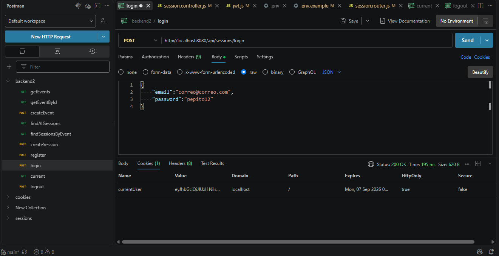
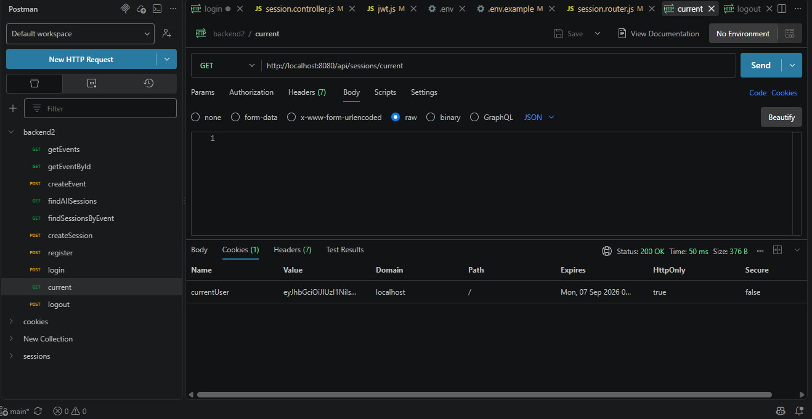
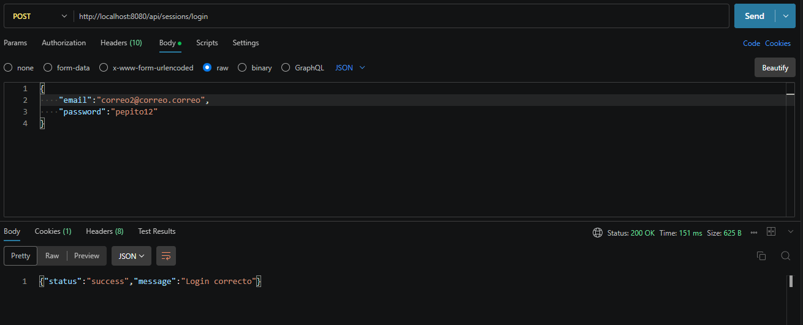
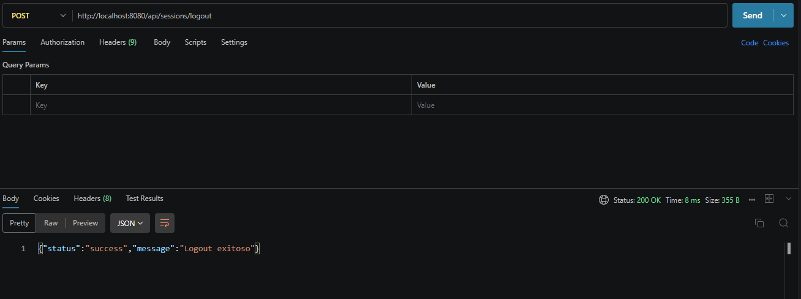

# Backend2
REPOSITORIO PARA LA PRE-ENTREGA 4
Repositorio de entregas para la materia Programacion Backend II: Diseño y Arquitectura Backend por Lorenzo Suarez Almeyra, temática de eventos y sesiones 

## Base de datos

- Estare utilizando MongoDB

## Tecnologías
- Node.js
- Express
- Nodemon
- dotenv
- mongoose
- cookie-parser
- jsonwebtoken
- passport
- passport-github2
- passport-jwt
- passport-local

## Instalación
```bash
npm install
```

## Iniciacion
```bash
npm run dev
```

## Rutas disponibles

### Health check

- `GET /api/health`

### Eventos

- `GET /api/events`
- `GET /api/events/:id`
- `POST /api/events/createEvent`

### Sesiones

- `GET /api/sessions`
- `GET /api/sessions/eventId/:eventId`
- `POST /api/sessions/createSession`
- `POST /api/sessions/register`
- `POST /api/sessions/login`
- `POST /api/sessions/logout`
- `GET /api/sessions/current`
- `GET /api/sessions/github/callback`
## Flujo de datos
Request → Router → Controller → Service → Repository → DAO → Model

## Estructura de carpetas

```text
backend2/
├── src/
│   ├── app.js
│   ├── server.js
│   ├── config/
│   │   ├── config.js
|   |   └── passport.config.js
│   ├── controllers/
│   │   ├── event.controller.js
│   │   └── session.controller.js
│   ├── dao/
│   │   ├── event.dao.js
│   │   ├── session.dao.js
│   │   └── user.dao.js
|   ├── dto/
|   |   └── userDTO.js
│   ├── middlewares/
|   |   └── authentication.middleware.js
│   │   └── error.middleware.js
│   ├── models/
│   │   ├── eventModel.js
│   │   ├── sessionModel.js
│   │   └── userModel.js
│   ├── repositories/
│   │   ├── event.repository.js
│   │   ├── session.repository.js
│   │   └── user.repository.js
│   ├── routes/
│   │   ├── event.router.js
│   │   └── session.router.js
│   ├── services/
│   │   ├── event.service.js
|   |   ├── session.service.js
│   │   └── user.service.js
│   └── utils/
│       └── hash.js
|       └── jwt.js
├── .env.example
├── .gitignore
├── package.json
├── package-lock.json
└── README.md
```
### Registrar un usuario

En el endpoint POST /api/sessions/register crea un usuario nuevo. El servidor debe estar iniciado y se debe enviar una peticion a:

```text
http://localhost:8080/api/sessions/register
```

El body debe ser un objeto JSON. Los campos `first_name`, `last_name`, `email` y `password` son obligatorios. El campo `role` no puede ser manipulado en el body

```json
{
    "first_name": "Bertram",
    "last_name": "García",
    "email": "bertram.garcia@example.com",
    "password": "12345678"
}
```

Durante el registro:

- Se eliminan los espacios al principio y al final del nombre, apellido y email.
- El email se convierte a minúsculas.
- Se valida que el email tenga un formato válido.
- La contraseña se guarda hasheada y no se devuelve en la respuesta.
- Se comprueba que el email no esté registrado previamente.

Respuesta exitosa (`201 Created`):

```json
{
    "status": "success",
    "payload": {
        "id": "ID_GENERADO_POR_MONGODB",
        "first_name": "Bertram",
        "last_name": "García",
        "email": "bertram.garcia@example.com",
        "role": "user"
    }
}
```

Si faltan campos obligatorios, el email no es válido o ya existe, la API devuelve una respuesta con `status: "error"` y un mensaje descriptivo.

### Login

El endpoint `POST /api/sessions/login` autentica al usuario. Se deben enviar el email y la contraseña en formato JSON:

```text
http://localhost:8080/api/sessions/login
```

Request:

```json
{
    "email": "bertram.garcia@example.com",
    "password": "12345678"
}
```

Response exitosa (`200 OK`):

```json
{
    "status": "success",
    "message": "Login correcto"
}
```

Además de la respuesta JSON, el servidor envía la cookie `currentUser` mediante el header `Set-Cookie`. Esta cookie contiene el token de autenticación y debe conservarse para realizar las peticiones protegidas.

### Usuario actual

El endpoint `GET /api/sessions/current` devuelve los datos incluidos en el token del usuario autenticado. La petición debe incluir la cookie `currentUser` obtenida durante el login:

```text
http://localhost:8080/api/sessions/current
```

Request:

```http
GET /api/sessions/current HTTP/1.1
Host: localhost:8080
Cookie: currentUser=TOKEN_JWT
```

Response exitosa (`200 OK`):

```json
{
    "status": "success",
    "payload": {
        "id": "ID_GENERADO_POR_MONGODB",
        "email": "bertram.garcia@example.com",
        "role": "user"
    }
}
```

Si no se envía la cookie, la API responde con (`401 Unauthorized`):

```json
{
    "status": "error",
    "message": "No autenticado"
}
```

### Logout

El endpoint `POST /api/sessions/logout` elimina la cookie `currentUser`:

```text
http://localhost:8080/api/sessions/logout
```

Request:

```http
POST /api/sessions/logout HTTP/1.1
Host: localhost:8080
Cookie: currentUser=TOKEN_JWT
```

Response exitosa (`200 OK`):

```json
{
    "status": "success",
    "message": "Logout exitoso"
}
```
## Estrategias de autenticación (Passport)

Passport se inicializa una sola vez en `src/app.js` mediante:

```js
app.use(passport.initialize())
```

Las estrategias se encuentran centralizadas en `src/config/passport.config.js`. De esta forma, las estrategias pueden ampliarse sin modificar la configuración principal de `app.js`.

### Estrategia `register`

La estrategia `register` utiliza `passport-local` y valida los datos recibidos en `POST /api/sessions/register`:

- Comprueba los campos obligatorios.
- Normaliza nombres, apellido y email.
- Valida el formato del email.
- Comprueba que el email no exista.
- Hashea la contraseña antes de guardarla.
- Asigna el rol `user` por defecto.

La ruta delega la autenticación en Passport:

```js
router.post(
    '/register',
    passport.authenticate('register', { session: false }),
    register
)
```

La respuesta exitosa utiliza el usuario creado y no expone la contraseña.

### Estrategia `login`

La estrategia `login` también utiliza `passport-local`. Busca el usuario por email, compara la contraseña con el hash almacenado y rechaza las credenciales inválidas con un mensaje genérico.

Ruta:

```text
POST /api/sessions/login
```

Después de una autenticación exitosa, el controlador genera un JWT con `id`, `email` y `role`, y lo envía en la cookie `currentUser`. La cookie se configura como `httpOnly`.

### Estrategia `current`

La estrategia `current` utiliza `passport-jwt`. Extrae el JWT desde la cookie `currentUser`, valida la firma con `JWT_SECRET` y busca nuevamente al usuario en la base de datos.

Ruta protegida:

```text
GET /api/sessions/current
```

Si la cookie es válida, devuelve un DTO con los datos públicos del usuario (`id`, `email` y `role`). Sin una cookie válida, responde con `401 Unauthorized`.

### Providers externos

La configuración está preparada para incorporar providers externos sin modificar `app.js`: cada provider puede agregarse como una estrategia independiente dentro de `src/config/passport.config.js` y conectarse desde el router.

Actualmente se encuentra configurada la estrategia de GitHub:

```text
GET /api/sessions/github
GET /api/sessions/github/callback
```

La misma estructura permite incorporar Google u otro provider en el futuro, manteniendo sin cambios la inicialización de Passport en `app.js`.

## Variables de entorno

Copia `.env.example` como `.env` y completa los valores correspondientes:

```env
PORT=8080
MONGO_URI=mongodb://localhost:27017/backend2
JWT_SECRET=una-clave-secreta
JWT_EXPIRES_IN=1h
NODE_ENV=development
```

Para utilizar GitHub, agrega también las credenciales de la aplicación OAuth:

```env
GITHUB_CLIENT_ID=tu_client_id
GITHUB_CLIENT_SECRET=tu_client_secret
GITHUB_CALLBACK_URL=http://localhost:8080/api/sessions/github/callback
```

Estas variables no deben incluirse en el repositorio. El archivo `.env.example` solo debe contener nombres de variables y valores de ejemplo.

## Capturas de entregas
### Entrega 1
- 
### Entrega 2
- 
- 
### Entrega 3
- 
- 
- 
### Entrega 4
- 
- 
- 
- 
- 
